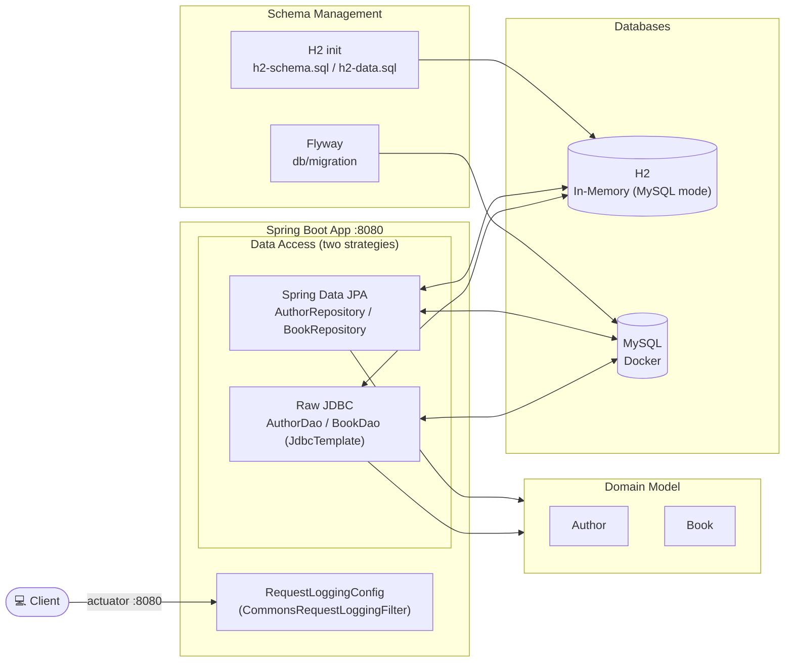
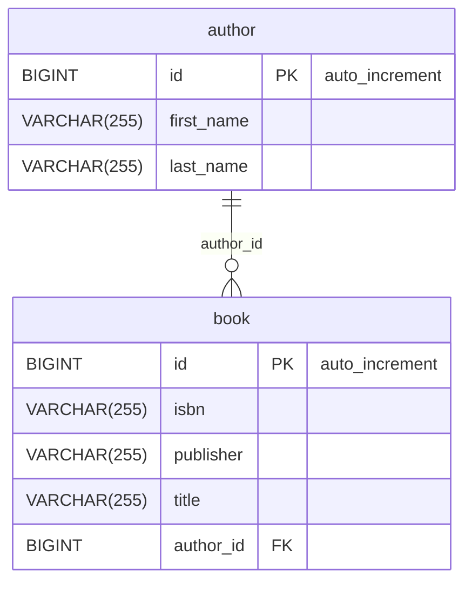

# Spring Data JPA - JDBC Template

Spring Boot 4 / Spring Data JPA demo project on Java 25, demonstrating raw JDBC access via `JdbcTemplate`
and Spring Data JPA repositories against H2 (MySQL-compat mode) and MySQL, with schema management via
Flyway.

## Architecture Overview

The project demonstrates two parallel data-access strategies over the same domain: raw JDBC via
`JdbcTemplate` (`dao` package) and Spring Data JPA repositories (`repository` package). There is no REST
controller — the only HTTP surface is the actuator.



## Database Schema



## Build & Test

```bash
./mvnw clean verify                                       # full build: format check, unit + IT tests, Helm lint/template
./mvnw clean install                                      # verify + build Docker image + package Helm chart
./mvnw test                                               # unit tests only (surefire, *Test)
./mvnw test -Dtest=BookRepositoryWithH2Test               # single test class
./mvnw test -Dtest=BookRepositoryWithH2Test#methodName    # single test method
./mvnw spotless:apply                                     # auto-fix pom/markdown/json/yaml/shell formatting
./mvnw spring-javaformat:apply                            # auto-fix Java code style
```

> Formatting is enforced at build time. Run both `spotless:apply` and `spring-javaformat:apply`
> before committing if the build fails at the `validate` phase.

## Flyway

Flyway is enabled in the `mysql` profile (`spring.flyway.enabled = true`) and applies the migrations in
`src/main/resources/db/migration`. The profile also starts MySQL on port 3306 via the Docker Compose file
`compose-mysql.yaml` (`spring.docker.compose.file`).

## Docker

The Docker Compose file `compose-mysql.yaml` runs the startup script `src/scripts/init-mysql.sql`, which
creates the `bookdb` database and the `bookadmin`/`bookuser` users.

## Kubernetes

Deployment is Helm-only (no raw Kubernetes manifests).

### Deployment with Helm

Be aware that we are using a different namespace here (not default).

Go to the directory where the tgz file has been created after `./mvnw clean install`

```powershell
cd target/helm/repo
```

unpack

```powershell
$file = Get-ChildItem -Filter sdjpa-jdbc-template-chart-*.tgz | Select-Object -First 1
tar -xvf $file.Name
```

install

```powershell
$APPLICATION_NAME = Get-ChildItem -Directory | Where-Object { $_.LastWriteTime -ge $file.LastWriteTime } | Select-Object -ExpandProperty Name
helm upgrade --install $APPLICATION_NAME ./$APPLICATION_NAME --namespace sdjpa-jdbc-template --create-namespace --wait --timeout 8m --debug --render-subchart-notes
```

show logs and show event

```powershell
kubectl get pods -n sdjpa-jdbc-template
```

replace $POD with pods from the command above

```powershell
kubectl logs $POD -n sdjpa-jdbc-template --all-containers
```

Show Details and Event

$POD_NAME can be: sdjpa-jdbc-template-mysql, sdjpa-jdbc-template

```powershell
kubectl describe pod $POD_NAME -n sdjpa-jdbc-template
```

Show Endpoints

```powershell
kubectl get endpoints -n sdjpa-jdbc-template
```

test

```powershell
helm test $APPLICATION_NAME --namespace sdjpa-jdbc-template --logs
```

status

```powershell
helm status $APPLICATION_NAME --namespace sdjpa-jdbc-template
```

uninstall

```powershell
helm uninstall $APPLICATION_NAME --namespace sdjpa-jdbc-template
```

delete all

```powershell
kubectl delete all --all -n sdjpa-jdbc-template
```

create busybox sidecar

```powershell
kubectl run busybox-test --rm -it --image=busybox:1.36 --namespace=sdjpa-jdbc-template --command -- sh
```

Verify the deployment via the actuator endpoint on NodePort 30080, e.g.
`http://localhost:30080/actuator/health`.

## Running the Application

1. Choose the `h2` or `mysql` profile (preconfigured IntelliJ runners are available in `.run/`).
2. Start the application with the appropriate profile.
3. With the `mysql` profile, Spring Boot Docker Compose starts MySQL and Flyway applies the schema.

## Sandbox (local dev environment)

The sandbox is provisioned by the opencode-sandbox-kit and runs as a Docker container. It mounts this
repo, starts the agent, and connects the IntelliJ MCP server. The app runs on port `8080`; the
`compose-mysql.yaml` file provides MySQL.

Allow the kit source (GitHub without cloning):

```powershell
sbx settings set kit.allowedSources --% "[\"docker.io/\",\"github.com/dboeckli/\"]"
```

Start a new sandbox:

```powershell
sbx run opencode `
    --kit "git+https://github.com/dboeckli/opencode-sandbox-kit.git#dir=opencode-agent" `
    --template docker/sandbox-templates:opencode-docker-0.5.0 `
    --skills=off `
    --static-mcp idea `
    . `
    "C:\development\maven-repo:ro"
```

Start the sandbox with Kubernetes support:

```powershell
sbx run opencode `
    --kit "git+https://github.com/dboeckli/opencode-sandbox-kit.git#dir=opencode-agent" `
    --template docker/sandbox-templates:opencode-docker-0.5.0 `
    --skills=off `
    --static-mcp idea `
    . `
    "$env:USERPROFILE\.kube:ro" `
    "C:\development\maven-repo:ro"
```

Claude Code (Home) and Mammouth Code variants:

```powershell
sbx run claude `
    --kit "git+https://github.com/dboeckli/opencode-sandbox-kit.git#dir=opencode-agent" `
    --template docker/sandbox-templates:claude-code-docker-0.5.0 `
    --skills=off `
    --static-mcp idea `
    . `
    "C:\development\maven-repo:ro"
```

```powershell
sbx run "git+https://github.com/dboeckli/opencode-sandbox-kit.git#dir=mammouth-agent" `
    --skills=off `
    --static-mcp idea `
    . `
    "C:\development\maven-repo:ro"
```

Apply the kit to an existing sandbox (restarts the sandbox, VM state is kept):

```powershell
sbx kit add <sandbox-name> "git+https://github.com/dboeckli/opencode-sandbox-kit.git#dir=opencode-agent"
```

### Start the app

Pick a profile (H2 needs no Docker; with MySQL, Spring Boot Docker Compose starts `compose-mysql.yaml`
automatically — starting it manually is optional):

```shell
docker compose -f compose-mysql.yaml up
```

Then run one of the IntelliJ run configurations (`.run/Spring6Application h2.run.xml`,
`.run/Spring6Application mysql.run.xml`) or start via
`./mvnw spring-boot:run -Dspring-boot.run.profiles=h2`.

### Sandbox build quirk

The sandbox mounts the repo via filesystem passthrough, which blocks symlinks — Spotless's `npm install`
(prettier) would fail with `EPERM` unless npm skips bin links. The kit sets `npm_config_bin_links=false`
globally, so no manual export is needed.

